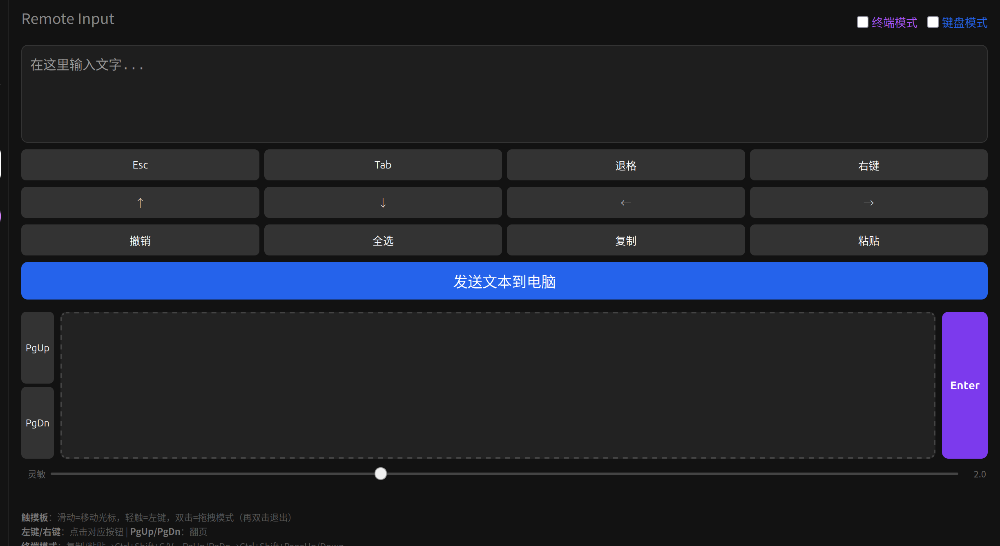
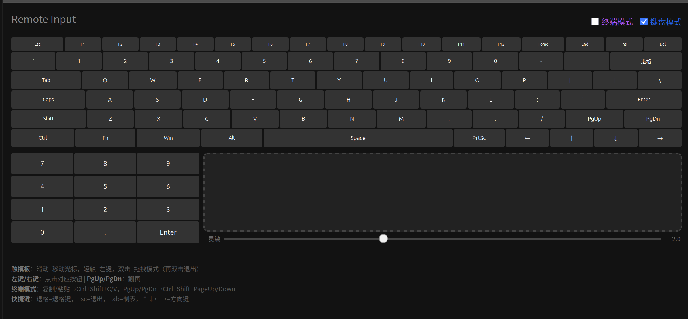

# Remote Input

手机远程输入工具，支持 Ubuntu Wayland 和 Windows。

手机浏览器打开网页，使用手机输入法（语音/拼音/手写）输入文字，点发送后自动粘贴到电脑当前光标位置。同时提供虚拟触摸板、鼠标按键、方向键、快捷键等完整远程控制能力。

## 仓库内容

```
remote_input_page/
├── remote_input.py           # 主程序
├── remote_input_launcher.sh  # Linux 启动脚本
├── start_service.bat         # Windows 启动脚本（带控制台）
├── start_silent.vbs          # Windows 静默启动（无窗口）
├── install_autostart.ps1     # Windows 开机自启安装脚本
├── requirements.txt          # Python 依赖
└── README.md
```

## 环境要求

### Linux (Ubuntu Wayland)
- Ubuntu 22.04+（Wayland，GNOME 桌面），测试环境：Ubuntu 26.04
- Python 3（系统自带），测试版本：3.14
- 手机和电脑在同一局域网

已测试的依赖版本：
- `ydotool` 1.0.4
- `wl-clipboard` 2.2.1

### Windows
- Windows 10/11
- Python 3.8+
- 手机和电脑在同一局域网

Windows 额外依赖（自动安装）：
- `pyautogui` - 鼠标键盘模拟
- `pyperclip` - 剪贴板操作

## 安装

### 1. 安装系统依赖

```bash
sudo apt install -y wl-clipboard ydotool
```

### 2. 配置用户权限

```bash
sudo usermod -aG input $USER
```

执行后**重新登录**生效。

### 3. 启动 ydotoold 服务

```bash
systemctl --user enable --now ydotool
```

### Windows 安装

```powershell
# 安装 Python 依赖
pip install -r requirements.txt

# 启动服务（带认证）
python remote_input.py --auth --token your_password
```

#### 开机自启

以管理员身份运行 PowerShell：

```powershell
.\install_autostart.ps1
```

这会注册一个 Task Scheduler 任务，用户登录时自动启动服务。

## 使用

### 启动服务

**强烈建议启用认证**，防止同一局域网下其他人误用或滥用：

```bash
# 自动生成随机 token（打印在终端）
python3 remote_input.py --auth

# 或指定自己的 token
python3 remote_input.py --auth --token your_password
```

不加 `--auth` 也可以直接使用，但局域网内任何人都能访问。

可选参数：

| 参数 | 说明 |
|------|------|
| `--auth` | 启用登录认证 |
| `--token XXX` | 指定自定义 token（需配合 `--auth`） |
| `--port PORT` | 指定监听端口（默认 8080） |

### Windows 启动

```powershell
# 带控制台启动（可看到日志）
.\start_service.bat

# 静默启动（无窗口，适合开机自启）
.\start_silent.vbs

# 或直接命令行
python remote_input.py --auth --token your_password
```

### 开机自启

创建 `.env` 文件存放 token（**不要提交到 git**）：

```bash
cp .env.example .env
# 编辑 .env，填入你的 token
```

使用 launcher 脚本启动：

```bash
# 前台启动（有终端时自动打开新窗口）
bash remote_input_launcher.sh

# 无头模式（适合 systemd 自启，无终端直接后台运行）
REMOTE_INPUT_HEADLESS=1 bash remote_input_launcher.sh
```

#### systemd 用户服务（推荐）

创建 systemd 服务实现开机自启：

```bash
mkdir -p ~/.config/systemd/user

cat > ~/.config/systemd/user/remote-input.service << 'EOF'
[Unit]
Description=Remote Input Service
After=network.target ydotool.service

[Service]
Type=simple
WorkingDirectory=$HOME/snap/remote_input_page
Environment=REMOTE_INPUT_HEADLESS=1
ExecStart=/bin/bash $HOME/snap/remote_input_page/remote_input_launcher.sh
Restart=on-failure
RestartSec=5

[Install]
WantedBy=default.target
EOF

systemctl --user daemon-reload
systemctl --user enable --now remote-input
```

查看状态：

```bash
systemctl --user status remote-input
journalctl --user -u remote-input -f
```

查看电脑局域网 IP：

```bash
ip -4 addr show | grep 'inet ' | grep -v '127.0.0.1'
```

### 手机访问

1. 手机连上和电脑同一个 Wi-Fi
2. 浏览器打开 `http://<电脑IP>:8080`
3. 如果启用了认证，先输入 Token 登录
4. 输入文字，点击"发送到电脑"

文字会出现在电脑当前光标位置（终端、浏览器、编辑器均适用）。


## 功能详解

### 文本输入

页面顶部提供输入框，使用手机自带输入法输入文字（支持语音、拼音、手写等），点击「发送文本到电脑」按钮后，文字通过 `wl-copy` 写入剪贴板，再由 `ydotool` 模拟 Shift+Insert 粘贴到当前光标位置。

### 快捷键按钮

输入框下方提供 3 行共 12 个快捷键按钮：

| 行 | 按钮 | 功能 | ydotool 实现 |
|----|------|------|-------------|
| 第 1 行 | Esc | 退出键 | `key 1:1 1:0` |
| 第 1 行 | Tab | 制表键 | `key 15:1 15:0` |
| 第 1 行 | 退格 | 退格键 | `key 14:1 14:0` |
| 第 1 行 | 右键 | 鼠标右键单击 | `click 0xC1` |
| 第 2 行 | ↑ | 方向上 | `key 103:1 103:0` |
| 第 2 行 | ↓ | 方向下 | `key 108:1 108:0` |
| 第 2 行 | ← | 方向左 | `key 105:1 105:0` |
| 第 2 行 | → | 方向右 | `key 106:1 106:0` |
| 第 3 行 | 撤销 | Ctrl+Z | `key 29:1 44:1 44:0 29:0` |
| 第 3 行 | 全选 | Ctrl+A | `key 29:1 30:1 30:0 29:0` |
| 第 3 行 | 复制 | Ctrl+C | `key 29:1 46:1 46:0 29:0` |
| 第 3 行 | 粘贴 | Shift+Insert | `key 42:1 110:1 110:0 42:0` |

### 虚拟键盘

页面右上角提供「键盘模式」开关。开启后隐藏文本输入区，显示完整虚拟键盘（含小键盘+触摸板）。


**布局：**
- 功能键行：Esc、F1-F12、Home/End/Ins/Del
- 数字行：带 Shift 符号（如 `1`/`!`、`2`/`@`），退格键
- 字母行：QWERTY 布局，Tab、括号、反斜杠
- 底部行：Shift（切换大写）、方向键、PgUp/PgDn、CapsLock、Ctrl/Alt/Win/Fn、空格
- 小键盘+触摸板区：数字键盘（7-9/4-6/1-3/0/./Enter）+ 触摸板，左右并排

**按键操作：**

| 手势 | 功能 | 说明 |
|------|------|------|
| 短按 | 普通按键 | 字母、空格等直接发送对应键码 |
| 长按（>500ms） | 发送 Shift 组合键 | 仅对有符号变体的键（数字/符号行），自动发送 Shift+该键 |
| 上滑（>30px） | 发送 Shift 组合键 | 同长按，上滑优先于长按；滑回原位可取消 |
| 点击 Shift | 切换 Shift 状态 | 蓝色高亮表示启用，按下任意字母键后自动关闭 |
| 点击 CapsLock | 切换大写锁定 | 蓝色高亮表示启用，字母键自动发送 Shift+字母 |

无符号变体的按键（字母、空格等）短按即发送，不受 Shift 状态影响。

### 终端模式

页面右上角提供「终端模式」开关。开启后，以下按键映射会改变以适配终端环境：

| 按钮 | 普通模式 | 终端模式 |
|------|---------|---------|
| 复制 | Ctrl+C | Ctrl+Shift+C |
| 粘贴 | Shift+Insert | Ctrl+Shift+V |
| PgUp | PageUp | Ctrl+Shift+PageUp |
| PgDn | PageDown | Ctrl+Shift+PageDown |

### 虚拟触摸板

页面下方中间区域为虚拟触摸板，支持以下操作：

| 手势 | 功能 | 说明 |
|------|------|------|
| 单指滑动 | 移动鼠标光标 | 40ms 节流（25 帧/秒），默认 2 倍灵敏度（可调节，设置自动保存） |
| 轻触（<300ms，无明显位移） | 鼠标左键单击 | 300ms 内松开触发 |
| 双击 | 进入拖拽模式 | 第二次按下时触发 mouse_down，松开手指触发 mouse_up |
| 双击退出拖拽 | 退出拖拽模式 | 拖拽中再双击可提前释放 |

拖拽模式状态机：`idle` → `pending_tap`（300ms 等待窗口）→ `dragging`（双击检测成功，按住左键拖动）→ 手指松开回到 `idle`。

### 灵敏度设置

触摸板下方提供灵敏度调节滑块（范围 0.3-5.0，默认 2.0）：

- 拖动滑块可实时调整触摸板灵敏度
- 设置会自动保存到浏览器 localStorage
- 下次打开页面时自动恢复上次的灵敏度设置

### 鼠标按键

鼠标控制区布局（从左到右）：

```
[左键]  [PgUp]  [    触摸板    ]  [Enter]
        [PgDn]
```

| 按钮 | 位置 | 功能 | ydotool 码 |
|------|------|------|-----------|
| 左键 | 红色按钮 | 鼠标左键单击 | `click 0xC0` |
| Enter | 紫色按钮 | 回车键 | `key 28:1 28:0` |
| PgUp | 触摸板左侧上方 | 向上翻页 | `key 104:1 104:0` |
| PgDn | 触摸板左侧下方 | 向下翻页 | `key 109:1 109:0` |

### 页面锁定

页面启用全局锁定，防止操作时意外滚动或选中文字：
- 全局禁用 `user-select`，防止滑动触摸板时选中文字
- 触摸板区域禁用 `contextmenu`，防止长按弹出菜单
- 使用 `touch-action: pan-x pan-y` 防止页面跟随滚动

## 通讯格式

前后端使用 JSON 格式通讯，POST 请求 body 结构：

```json
{
    "type": "文本|key|shortcut|mouse_move|mouse_click|mouse_down|mouse_up",
    "value": "具体值",
    "x": 0,
    "y": 0,
    "term_mode": false
}
```

支持的 type 及对应 value：

| type | value | 说明 |
|------|-------|------|
| `text` | 文本内容 | 粘贴文本到光标位置 |
| `key` | Linux 键码（如 `28`、`103`） | 单键按下释放 |
| `key_combo` | 逗号分隔键码（如 `42,3` 表示 Shift+2） | 多键组合（按住第一个键，按第二个键，再释放） |
| `shortcut` | `ctrl+a` / `ctrl+z` / `ctrl+c` / `shift+insert` | 组合键 |
| `mouse_move` | `x`, `y`（相对偏移） | 移动鼠标光标 |
| `mouse_click` | `left` / `right` | 鼠标单击 |
| `mouse_down` | `left` / `right` | 鼠标按键按下 |
| `mouse_up` | `left` / `right` | 鼠标按键释放 |

`term_mode` 字段随每次请求发送，用于后端判断是否启用终端模式按键映射。

## 认证机制

启用 `--auth` 后，采用挑战-应答（Challenge-Response）认证：

1. 客户端请求 `/login?get_nonce=1`，服务端返回随机 nonce（60 秒有效）
2. 客户端在浏览器端对 `nonce + token` 计算 SHA-256 哈希
3. 客户端将哈希值 POST 到 `/login`
4. 服务端遍历所有未过期 nonce，用相同算法验证哈希匹配
5. 验证通过后颁发 HttpOnly session cookie

Token 在浏览器端 SHA-256 哈希后传输，**永远不会明文传输**。

## 工作原理

1. 电脑运行 HTTP 服务，监听 8080 端口
2. 手机浏览器打开网页，输入文字
3. 点击发送后，文字通过 HTTP POST 传到电脑
4. 电脑执行 `wl-copy` 将文字写入剪贴板（CLIPBOARD + PRIMARY）
5. `ydotool` 通过 `/dev/uinput` 模拟 Shift+Insert 按键，触发粘贴

关键设计：
- `ydotool` 走内核接口注入按键，不受 Wayland 沙箱限制
- 同时写入 CLIPBOARD 和 PRIMARY 两个剪贴板，确保终端和浏览器都能正确粘贴
- 使用 Shift+Insert 而非 Ctrl+V，兼容终端和图形界面
- 按键事件间加 50ms 延迟，避免系统输入状态机不同步
- 触摸板使用 `ydotool mousemove -x -y` 实现相对坐标移动
- 鼠标按键使用 ydotool 1.0.4 的 `0xC0`/`0xC1`（单击）、`0x40`/`0x41`（按下）、`0x80`/`0x81`（释放）码

## 常见问题

### 手机打不开网页

- 确认手机和电脑在同一 Wi-Fi
- 检查防火墙：`sudo ufw allow 8080`

### 粘贴没反应

- 检查 ydotoold 是否运行：`systemctl --user status ydotool`
- 确认用户在 input 组：`id -nG $USER | grep input`

### 中文粘贴为空

- 测试剪贴板：`echo "测试" | wl-copy && wl-paste`
- 如果 wl-paste 为空，重启 GNOME Shell（Alt+F2 输入 `r` 回车）

### 触摸板滑动没反应

- 确认 ydotoold 正在运行
- 尝试在电脑上移动鼠标确认 ydotool 正常：`ydotool mousemove -x 50 -y 50`

## 贡献

欢迎提交 Issue 和 Pull Request。

1. Fork 本仓库
2. 创建特性分支：`git checkout -b feature/your-feature`
3. 提交更改
4. 推送到分支：`git push origin feature/your-feature`
5. 创建 Pull Request

如果发现了 Bug 或有功能建议，请先开 Issue 讨论。

## License

MIT
